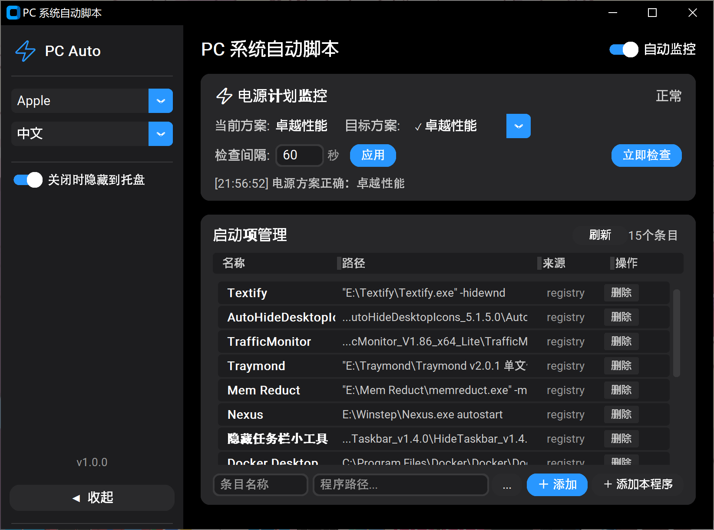
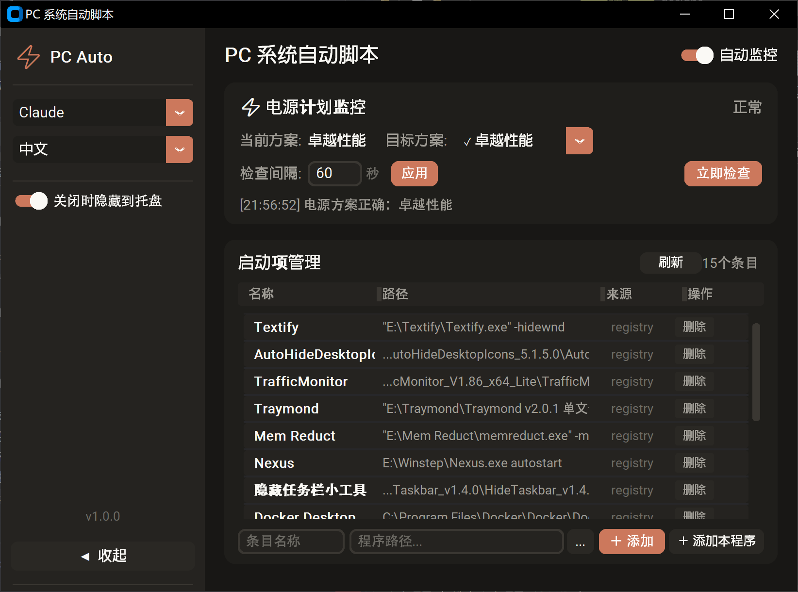
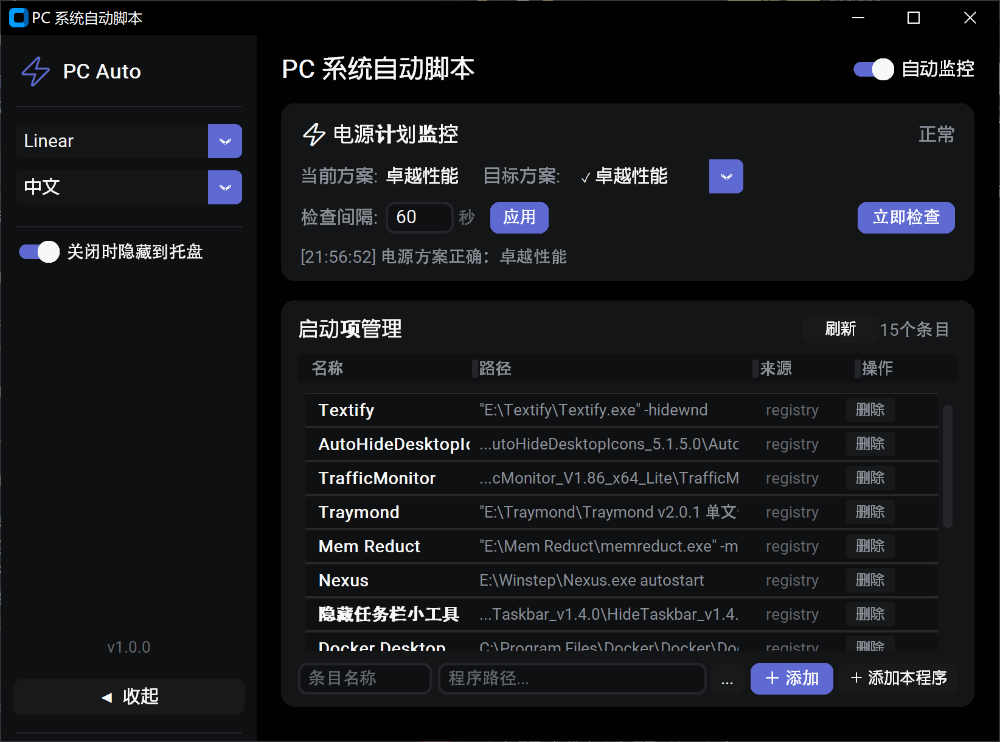
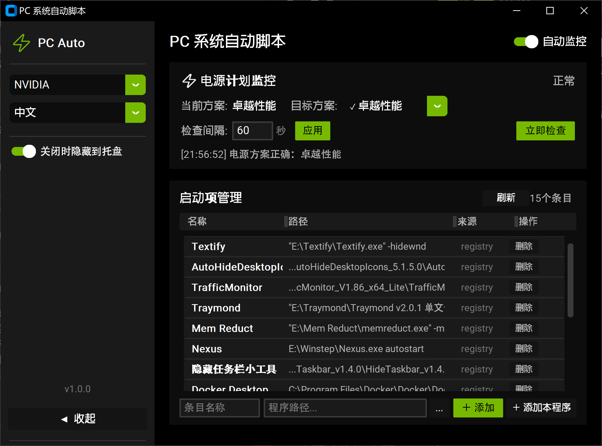
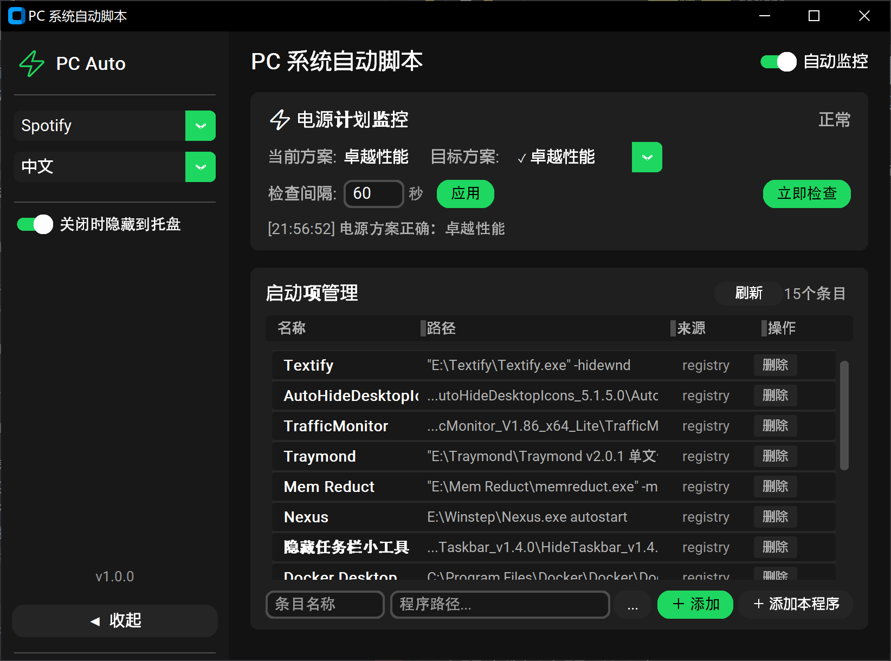

# PC System Auto Scripts

Windows 桌面工具：电源计划自动监控 + 启动项管理，支持中英文切换、5 套暗色主题、系统托盘常驻。

## 功能

- **电源计划监控** — 自动检测当前电源方案，若非高性能/卓越性能则自动切换，支持自定义检查间隔和目标方案
- **启动项管理** — 查看/添加/删除 Windows 注册表启动项（`HKCU\Run`），可调列宽
- **5 套设计风格** — Magic Dark / Magic Slate / Magic Aurora / Magic Ember / Magic Ocean，一键切换
- **中英文双语** — 所有 UI 文字实时切换
- **系统托盘** — 关闭窗口时最小化到托盘，托盘菜单支持快捷操作
- **可收折侧边栏** — 收起后仅显示图标按钮，节省空间
- **单实例运行** — 重复启动时自动唤起已有窗口

## 快速上手

直接运行 `dist/PC_System_Auto_Scripts.exe`，无需安装 Python 或任何依赖。

- 首次运行会生成 `config.json`，可自行修改配置
- 关闭窗口默认隐藏到系统托盘，右键托盘图标可退出
- 侧边栏可切换风格（5 套暗色主题）和语言（中文/English）

## 界面预览

| Magic Dark | Magic Slate | Magic Aurora |
|------------|-------------|--------------|
|  |  |  |

| Magic Ember | Magic Ocean |
|-------------|-------------|
|  |  |

## 技术栈

| 层级 | 选型 |
|------|------|
| UI 框架 | [customtkinter](https://github.com/TomSchimansky/CustomTkinter) 5.2 |
| 系统托盘 | [pystray](https://github.com/moses-palmer/pystray) |
| 打包 | [PyInstaller](https://pyinstaller.org/) 6.20 |
| 图标生成 | Pillow |
| 语言 | Python 3.14 |

## 项目结构

```
├── main.py
├── styles.py
├── i18n.py
├── power_manager.py
├── startup_manager.py
├── build.py
├── config.json
├── requirements.txt
└── designs/
```

## 开发

```bash
# 安装依赖
pip install -r requirements.txt

# 运行
python main.py

# 打包为 exe
python build.py
```

打包产物输出到 `dist/PC_System_Auto_Scripts.exe`。

## 配置

`config.json`（与 exe 同目录）：

| 字段 | 类型 | 说明 |
|------|------|------|
| `style` | string | 当前风格：`Magic Dark` / `Magic Slate` / `Magic Aurora` / `Magic Ember` / `Magic Ocean` |
| `language` | string | 界面语言：`zh` / `en` |
| `monitor_enabled` | bool | 启动时是否开启电源监控 |
| `check_interval` | int | 电源检查间隔（秒） |
| `target_guid` | string | 目标电源方案 GUID，留空则自动匹配高性能 |
| `minimize_to_tray` | bool | 关闭窗口时隐藏到托盘 |
| `col_widths` | float[4] | 启动项列表列宽比例 |

## License

MIT

