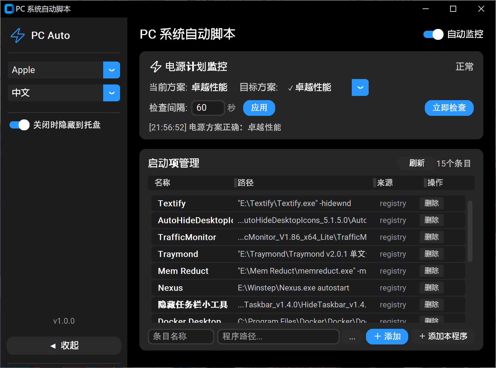
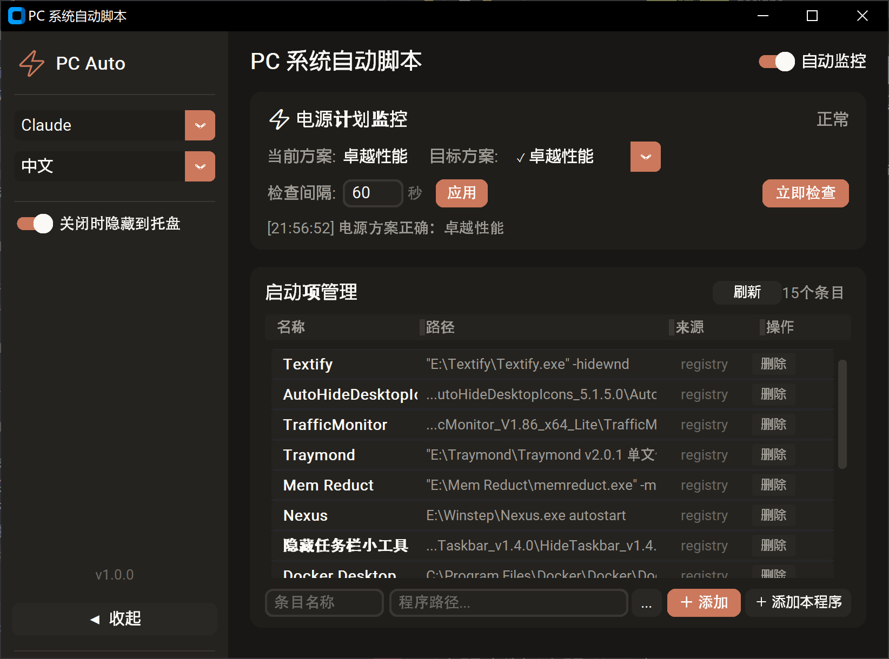
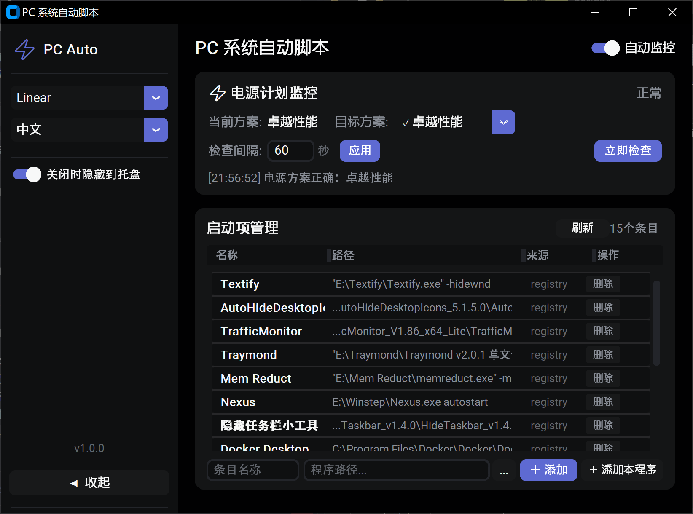
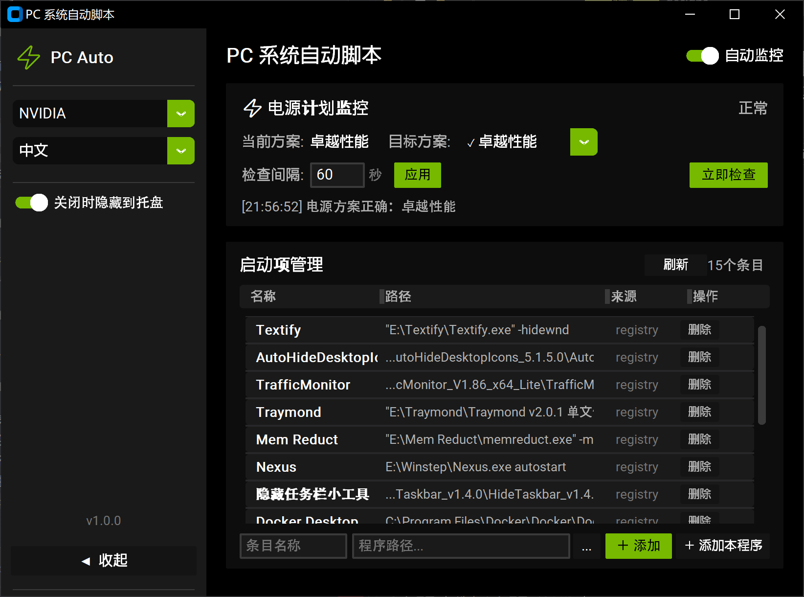
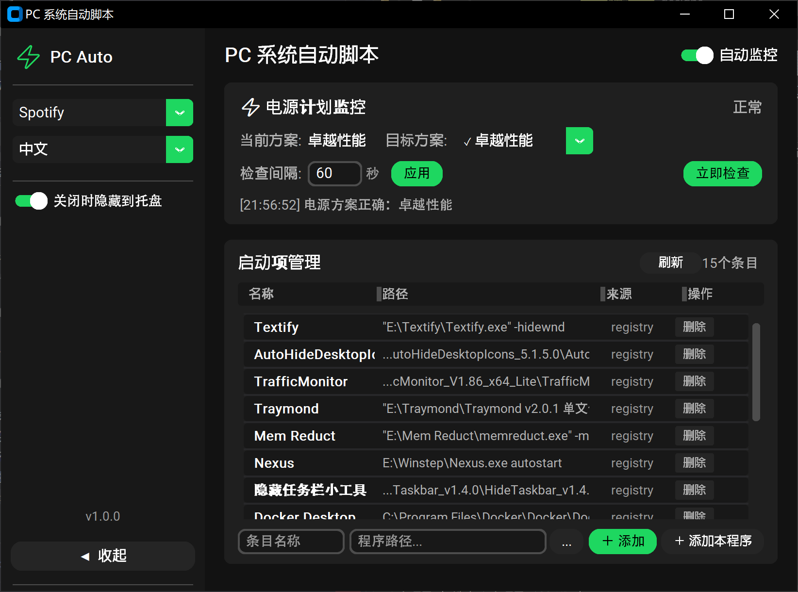

# PC System Auto Scripts

Windows 桌面工具：电源计划自动监控 + 启动项管理，支持中英文切换、5 套暗色主题、系统托盘常驻、精简模式。

## 功能

- **电源计划监控** — 检测当前电源方案，偏离目标时自动切换；可设检查间隔、目标方案（按 GUID 绑定）
- **启动项管理** — 查看/添加/删除注册表中的启动项与两个启动文件夹中的文件，可调列宽、按列排序与筛选
- **读取不改系统** — 打开窗口、刷新、切换语言都不会修改电源设置；“创建性能方案”和切换方案是明确的独立操作
- **删除可撤销** — 删除启动项前显示名称/来源/命令并二次确认，删除前自动备份，标题栏“恢复”可撤销
- **5 套设计风格** — Magic Dark / Magic Slate / Magic Aurora / Magic Ember / Magic Ocean，一键切换
- **中英文双语** — 所有 UI 文字实时切换
- **系统托盘** — 可设为关闭窗口时最小化到托盘，托盘菜单支持快捷切换方案与立即检查
- **精简模式** — 变成 260×168 的悬浮小窗，只保留切换方案/语言/外观
- **单实例运行** — 命名互斥体保证只运行一个实例，重复启动会唤起已有窗口
- **首次运行引导** — 展示当前方案、目标策略与监控开关，由用户选择策略后再启用

## 快速上手

直接运行 `dist/PC_System_Auto_Scripts.exe`，无需安装 Python 或任何依赖。

- 首次运行会生成 `config.json`（默认与 exe 同目录；该目录不可写时自动改用 `%LOCALAPPDATA%\PC_System_Auto_Scripts\`）
- 首次运行会弹出设置窗口：查看当前电源方案 → 选择目标策略 → 决定是否启用自动监控
- 关闭窗口默认隐藏到系统托盘，右键托盘图标可退出（可在侧边栏关闭此行为）
- 侧边栏可切换风格（5 套暗色主题）和语言（中文/English）

## 界面预览

> 下图是设计稿，不是当前程序的实机截图。

| Magic Dark | Magic Slate | Magic Aurora |
|------------|-------------|--------------|
|  |  |  |

| Magic Ember | Magic Ocean |
|-------------|-------------|
|  |  |

## 技术栈

| 层级 | 选型 |
|------|------|
| UI 框架 | [customtkinter](https://github.com/TomSchimansky/CustomTkinter) 5.2.2 |
| 系统托盘 | [pystray](https://github.com/moses-palmer/pystray) 0.19.5 |
| 打包 | [PyInstaller](https://pyinstaller.org/) 6.20.0 |
| 图标生成 | Pillow 12.2.0 |
| 拼音排序 | pypinyin 0.55.0 |
| 语言 | Python 3.12+（仅 Windows：使用 `winreg` 与 `ctypes.windll`） |

## 项目结构

```
├── main.py               # UI、配置、单实例、托盘、监控协调
├── power_manager.py      # 电源方案读取 / 判定 / 切换 / 监控线程
├── startup_manager.py    # 启动项读取 / 增删 / 备份与恢复
├── styles.py             # 5 套设计风格
├── i18n.py               # 中英文文案
├── build.py              # PyInstaller 打包脚本
├── requirements.txt      # 已验证依赖版本
├── config.json           # 运行配置（首次运行自动生成）
├── tests/                # 回归测试（见下）
└── designs/              # 设计参考图
```

## 开发

```bash
# 安装依赖
pip install -r requirements.txt

# 运行
python main.py

# 回归测试（不需要管理员权限，不会改动注册表/电源设置/真实启动文件夹）
python tests/run_tests.py
# 或
python -m unittest discover -s tests -v

# 打包为 exe
python build.py            # 保留已有 config.json / startup_backups / 日志
python build.py --clean    # 额外删除生成的 .spec
```

打包产物输出到 `dist/PC_System_Auto_Scripts.exe`。**重新打包不会删除** `dist/config.json`、`dist/startup_backups/` 和 `dist/pc_auto_scripts.log`（旧的构建脚本会清空整个 `dist`，已修正）。

## 配置

`config.json`（默认与 exe 同目录；目录不可写时放在 `%LOCALAPPDATA%\PC_System_Auto_Scripts\`）：

| 字段 | 类型 | 说明 |
|------|------|------|
| `style` | string | 当前风格：`Magic Dark` / `Magic Slate` / `Magic Aurora` / `Magic Ember` / `Magic Ocean` |
| `language` | string | 界面语言：`zh` / `en` |
| `monitor_enabled` | bool | 是否启用自动监控（关闭后重启仍保持关闭） |
| `check_interval` | int | 电源检查间隔（秒），范围 10–3600 |
| `target_guid` | string | 目标电源方案 GUID；留空 = 自动选择（卓越性能 → 高性能），GUID 不存在时会明确提示而不是偷偷换目标 |
| `minimize_to_tray` | bool | 关闭窗口时隐藏到托盘 |
| `start_to_tray` | bool | 启动后直接进入托盘（默认 true） |
| `col_widths` | float[4] | 启动项列表列宽比例 |
| `setup_completed` | bool | 是否已完成首次运行引导 |

配置写入采用“临时文件 + 原子替换”；文件损坏时会保留为 `config.json.corrupt` 并回退默认值，保存失败会在界面提示。

## 运行数据与日志

| 路径 | 说明 |
|------|------|
| `config.json` | 用户配置 |
| `pc_auto_scripts.log` | 滚动日志（512 KB × 3），排查失败原因用 |
| `startup_backups/` | 删除启动项前的文件备份 |
| `startup_backups.json` | 可撤销删除的备份台账 |

也可用环境变量 `PC_AUTO_SCRIPTS_DATA_DIR` 指定数据目录（测试用）。

## 启动项说明

- 覆盖范围：`HKCU\...\Run`、`HKLM\...\Run`、`HKLM\...\WOW6432Node\...\Run`、当前用户启动文件夹、公共启动文件夹
- 启动文件夹内的条目以**完整路径**为标识，所以 `demo.cmd` 与 `demo.lnk` 是两条互不影响的项目
- 删除前会弹出确认框，显示名称、来源、命令/文件路径；确认后先备份再删除
- 删除 HKLM/公共启动文件夹的条目可能需要管理员权限，失败时会显示原因
- “显示启用状态/一键禁用”尚未实现：`Run` 值或启动文件存在并不等于 Windows 实际允许它启动

## 已知限制

- 电源方案读取依赖 `powercfg`；超时、权限不足、无可读数据会分别提示不同原因
- 自动监控只在运行期间生效，退出后不再纠正电源方案
- 中文/英文、100%/150%/200% 缩放、精简模式下的长路径尚未做完整实机验收

## License

MIT
